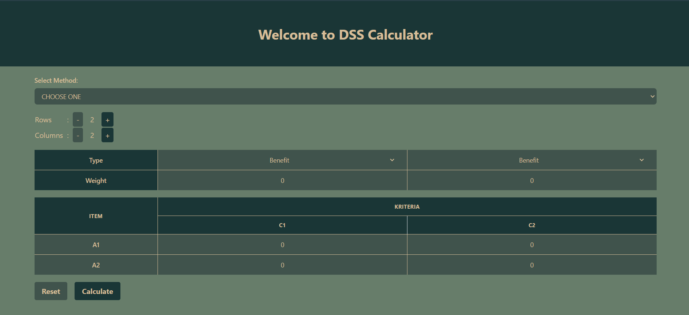
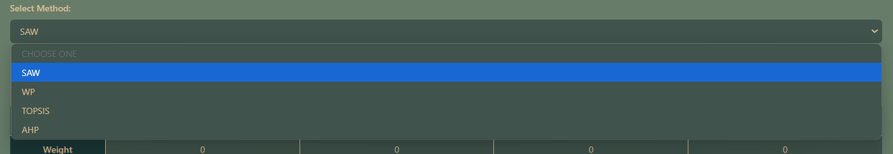
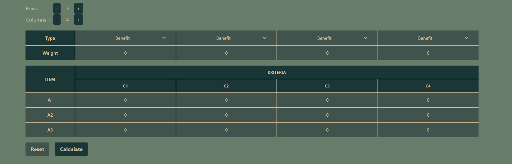
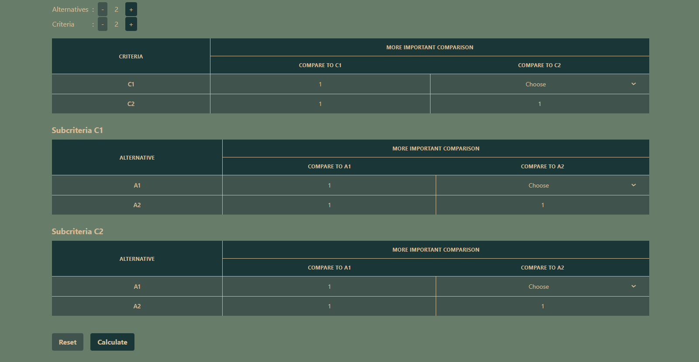
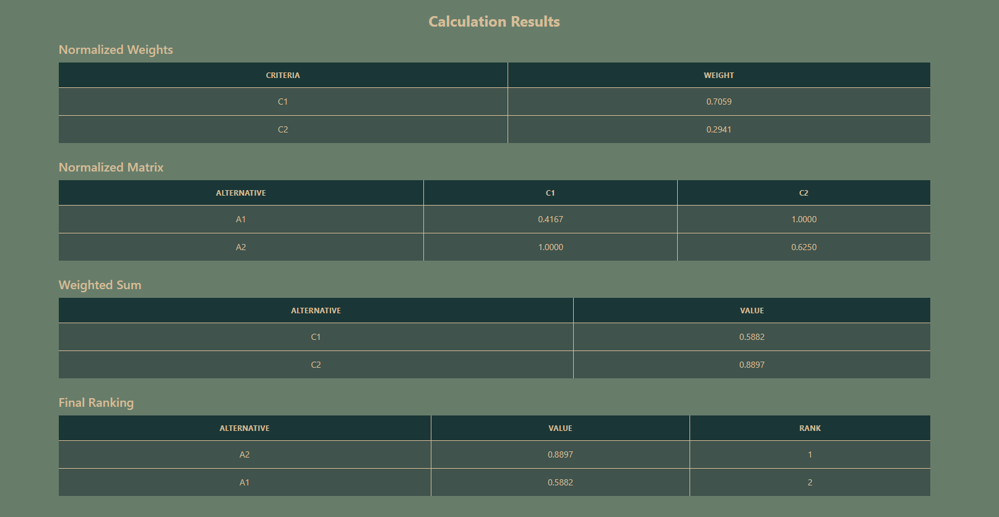
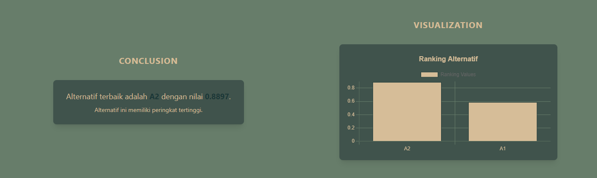

# Multi-Criteria Decision Making Web Application

This web-based application is designed to assist users in making complex decisions using multiple criteria decision making (MCDM) methods. It integrates four popular MCDM techniques: SAW (Simple Additive Weighting), WP (Weighted Product), TOPSIS (Technique for Order of Preference by Similarity to Ideal Solution), and AHP (Analytical Hierarchy Process).

## Features

- User-friendly interface for inputting criteria, alternatives, and weights
- Implementation of four MCDM methods: SAW, WP, TOPSIS, and AHP
- Comparison of results from different methods
- Responsive design for access from various devices (desktop, tablet, mobile)
- Quick and objective decision recommendations

## Setup

To run this project locally, follow these steps:

1. Clone the repository
   ```
   git clone https://github.com/callmeAngga/DSS-WebCalculator.git
   ```

2. Navigate to the project directory
   ```
   cd DSS-WebCalculator
   ```

3. Install dependencies
   ```
   npm install
   ```

4. Start the development server
   ```
   npm start
   ```

5. Open your browser and visit `http://localhost:3000`

## Technologies Used

- React.js
- Tailwind.css

## Our Project Looks Like







